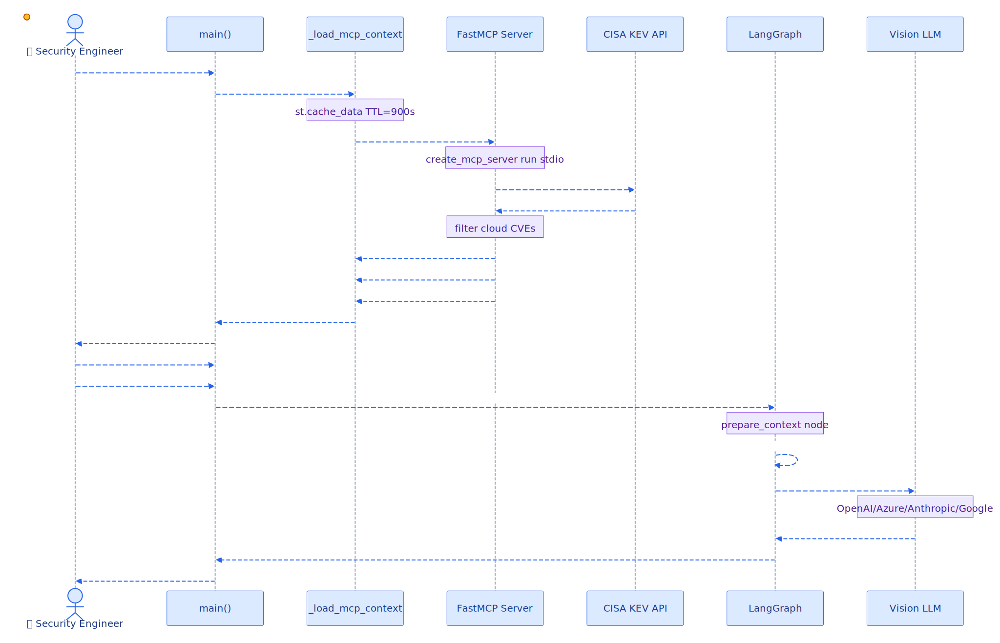

<p align="center">
  <a href="https://python.org"></a>
  <a href="LICENSE"></a>
  <a href="https://github.com/madichetti/mcp-server-cyberthreats/actions"></a>
</p>

# 🛡️ MCP Server CyberThreats — AI Cloud Architecture Security Auditor

> AI-powered cloud architecture security auditor backed by live CISA threat intelligence.

Upload a cloud architecture diagram (PNG/JPG) and receive a structured Markdown security report — complete with Terraform remediation snippets — cross-referenced against current [CISA Known Exploited Vulnerabilities](https://www.cisa.gov/known-exploited-vulnerabilities-catalog).

---

## Table of Contents

- [Executive Summary](#-executive-summary)
- [Features](#-features)
- [How It Works](#-how-it-works)
- [Quick Start](#-quick-start)
  - [Prerequisites](#prerequisites)
  - [Install](#install)
  - [Configure](#configure)
  - [Run](#run)
- [MCP Server](#-mcp-server)
  - [Primitives](#primitives)
  - [Claude Desktop](#claude-desktop)
  - [VS Code Copilot](#vs-code-copilot-agent-mode)
- [Architecture](#-architecture)
  - [Solution Overview](#solution-overview)
  - [Audit Workflow](#audit-workflow)
  - [Component Detail](#component-detail)
- [Project Structure](#-project-structure)

---

## 📋 Executive Summary

CyberThreats is an AI-driven security auditing tool that transforms cloud architecture diagrams into actionable security reports in seconds. Upload a PNG or JPG diagram and the tool automatically cross-references your architecture against the [CISA Known Exploited Vulnerabilities (KEV)](https://www.cisa.gov/known-exploited-vulnerabilities-catalog) catalog, identifying critical risks and generating production-ready Terraform remediation code.

The system is built on three integrated layers:

- **FastMCP stdio server** — a lightweight, stateless threat-intelligence provider that streams live CISA KEV data. It carries no LLM dependency; the MCP host (Claude Desktop, VS Code Copilot, or the Streamlit app) supplies all reasoning.
- **LangGraph workflow** — orchestrates context preparation (CVE enrichment) and vision-model analysis in a two-node graph, with optional LangSmith observability.
- **Streamlit front-end** — a browser-based UI connecting both layers; supports four pluggable vision LLM providers (OpenAI, Azure OpenAI, Anthropic, Google Gemini).

This makes CyberThreats useful in two distinct modes: as a standalone web application for one-off audits, and as an MCP tool registered in any compliant AI assistant for on-demand threat-intel retrieval inside agentic workflows.

---

## ✨ Features

- 🔍 Vision-model analysis of cloud architecture diagrams (PNG/JPG)
- 🔗 Live CISA KEV threat intelligence via a FastMCP stdio server
- 🧠 Pluggable LLM providers: OpenAI, Azure OpenAI, Anthropic, Google Gemini
- 📝 Markdown security report with Terraform remediation suggestions
- 📊 Executive summary + developer-focused findings in one output
- 🔁 LangGraph orchestration with automatic LangSmith tracing
- ⚡ MCP server connectable from Claude Desktop, VS Code Copilot, and more

---

## ⚙️ How It Works

```
Upload diagram
     │
     ▼
┌─────────────────────────────────────────────────┐
│  LangGraph Workflow                             │
│                                                 │
│  Node 1: prepare_context                       │
│    └─ MCP stdio server → CISA KEV feed         │
│       → audit_prompt enriched with live CVEs   │
│                                                 │
│  Node 2: analyze_architecture                  │
│    └─ Vision LLM (provider from LLM_PROVIDER)  │
│       → Markdown report + Terraform patches    │
└─────────────────────────────────────────────────┘
     │
     ▼
Security report in Streamlit UI
```

1. **Fetch threat intel** — the MCP stdio server queries the CISA KEV feed and returns cloud-relevant CVEs.
2. **Build audit prompt** — live CVE data is embedded into the prompt template.
3. **Vision analysis** — the diagram + enriched prompt are sent to the configured vision LLM.
4. **Report** — a structured Markdown report with risk prioritization and Terraform remediation is returned.

---

## 🚀 Quick Start

### Prerequisites

- Python 3.14+
- [`uv`](https://docs.astral.sh/uv/) package manager
- API key for at least one [supported LLM provider](#configure)

### Install

```bash
git clone https://github.com/madichetti/mcp-server-cyberthreats
cd mcp-server-cyberthreats
uv sync
```

### Configure

Copy `.env.example` to `.env` and fill in the values for your chosen provider:

```bash
cp .env.example .env
```

Set `LLM_PROVIDER` to one of `openai` | `azure` | `anthropic` | `google`, then provide the matching API key(s).

#### Provider environment variables

<details>
<summary><strong>OpenAI</strong> (default)</summary>

```env
LLM_PROVIDER=openai
OPENAI_API_KEY=sk-...
OPENAI_MODEL=o1           # optional, default: o1
```

</details>

<details>
<summary><strong>Azure OpenAI</strong></summary>

```env
LLM_PROVIDER=azure
AZURE_OPENAI_API_KEY=...
AZURE_OPENAI_ENDPOINT=https://<resource>.openai.azure.com/
AZURE_OPENAI_MODEL=gpt-4o                  # optional, default: gpt-4o
AZURE_OPENAI_API_VERSION=2024-12-01-preview  # optional
```

</details>

<details>
<summary><strong>Anthropic</strong></summary>

```env
LLM_PROVIDER=anthropic
ANTHROPIC_API_KEY=sk-ant-...
ANTHROPIC_MODEL=claude-3-7-sonnet-20250219   # optional
```

</details>

<details>
<summary><strong>Google Gemini</strong></summary>

```env
LLM_PROVIDER=google
GOOGLE_API_KEY=AIza...
GOOGLE_MODEL=gemini-2.0-flash   # optional
```

</details>

#### All configuration variables

| Variable | Required | Default | Description |
|---|---|---|---|
| `LLM_PROVIDER` | ✅ | `openai` | `openai` \| `azure` \| `anthropic` \| `google` |
| `OPENAI_API_KEY` | if openai | — | OpenAI secret key |
| `OPENAI_MODEL` | — | `o1` | OpenAI model name |
| `AZURE_OPENAI_API_KEY` | if azure | — | Azure OpenAI key |
| `AZURE_OPENAI_ENDPOINT` | if azure | — | `https://<resource>.openai.azure.com/` |
| `AZURE_OPENAI_MODEL` | — | `gpt-4o` | Azure deployment name |
| `AZURE_OPENAI_API_VERSION` | — | `2024-12-01-preview` | API version |
| `ANTHROPIC_API_KEY` | if anthropic | — | Anthropic API key |
| `ANTHROPIC_MODEL` | — | `claude-3-7-sonnet-20250219` | Anthropic model |
| `GOOGLE_API_KEY` | if google | — | Google AI API key |
| `GOOGLE_MODEL` | — | `gemini-2.0-flash` | Gemini model |
| `MODEL_MAX_TOKENS` | — | `1500` | Token budget for the report |
| `CISA_THREAT_LIMIT` | — | `8` | Max CVEs fetched per refresh |
| `MCP_CACHE_TTL` | — | `900` | Threat intel cache TTL (seconds) |
| `LANGSMITH_TRACING` | — | `false` | Enable LangSmith tracing |
| `LANGSMITH_API_KEY` | — | — | LangSmith API key |
| `LANGSMITH_PROJECT` | — | `cyberthreats` | LangSmith project name |

### Run

```bash
uv run streamlit run src/mcp_server_cyberthreats/app/ui.py
```

Open [http://localhost:8501](http://localhost:8501) in your browser.

**Usage:**

1. The **sidebar** shows live CISA KEV threat intel. Click **Refresh Threat Intel** to reload.
2. **Upload** a PNG or JPG cloud architecture diagram.

---

## 🏗️ Build & Publish (PowerShell)

The repo includes two convenience scripts in `scripts/`:

### Build (create dist/ artifacts)

```powershell
.
\scripts\build.ps1
```

This cleans previous build artefacts, runs `uv build` to produce an sdist + wheel, and validates the output with `twine check`.

### Publish (PyPI / TestPyPI)

Provide a PyPI API token either via `-PyPIToken <token>` or via the environment variables `UV_PUBLISH_TOKEN` / `TWINE_PASSWORD`.

```powershell
# Publish to PyPI
.
\scripts\publish.ps1 -PyPIToken <token>

# Publish to TestPyPI
.
\scripts\publish.ps1 -TestPyPI -PyPIToken <token>
```

---

## 🏷️ Release tags & build artifacts

This repo includes a GitHub Actions workflow that **builds and stores release artifacts whenever you push a `v*` tag** (e.g. `v1.0.0`). The workflow produces the same `dist/` wheel + sdist files as `scripts/build.ps1` and attaches them to a GitHub Release.

### 1) Create a tag

```powershell
git tag -a v1.0.0 -m "Release v1.0.0"
git push origin v1.0.0
```

### 2) What happens next

- GitHub Actions runs `release-build.yml` (triggered by `refs/tags/v*`).
- The build output is uploaded as a workflow artifact and attached to a Release.
- You can download the artifacts from the workflow run or from the GitHub Release page.

> If you want to run builds on every `main` commit instead, update `.github/workflows/release-build.yml` to trigger on `push: branches: [main]`.

---

3. Click **Analyze with MCP Intel** — the LangGraph workflow runs and the report appears below.

## 📁 Example Input & Output

A sample diagram and the generated security report are included in the `examples/` folder:


---

## 🖧 MCP Server

The threat-intelligence backend is a [FastMCP](https://github.com/jlowin/fastmcp) stdio server. It runs as a child process of the Streamlit app but can also be connected directly from Claude Desktop or VS Code Copilot.

### Primitives

| Type | Name / URI | Description |
|---|---|---|
| Tool | `get_live_cisa_threats(limit)` | Cloud-relevant KEV entries as Markdown |
| Tool | `get_cisa_feed_metadata()` | Feed URL, fetch timestamp, keyword list |
| Resource | `intel://cisa/cloud-keywords` | Keyword filter list |
| Resource | `intel://cisa/feed-info` | Feed source description |
| Prompt | `audit_prompt` | Full audit prompt template |

### Server environment variables

The MCP server itself has **no LLM dependency**. It fetches and filters CISA KEV data and returns it as plain text to the calling AI client. The only meaningful server-side variable is:

| Variable | Required | Default | Description |
|---|---|---|---|
| `CISA_THREAT_LIMIT` | — | `8` | Maximum CVEs returned by `get_live_cisa_threats` |

> LLM provider keys (`OPENAI_API_KEY`, `ANTHROPIC_API_KEY`, etc.) belong to the **Streamlit app** configuration only. When the MCP server is consumed by Claude Desktop or VS Code Copilot, those clients supply their own LLM — the server never calls one.

---

### Claude Desktop

Config file location:
- **Windows:** `%APPDATA%\Claude\claude_desktop_config.json`
- **macOS:** `~/Library/Application Support/Claude/claude_desktop_config.json`

Replace `/path/to/mcp-server-cyberthreats` with the absolute path to the repo root (e.g. `C:\Users\you\mcp-server-cyberthreats` on Windows).

```json
{
  "mcpServers": {
    "mcp-server-cyberthreats": {
      "command": "uv",
      "args": ["run", "--project", "/path/to/mcp-server-cyberthreats", "python", "-m", "mcp_server_cyberthreats.mcp.server"],
      "env": {
        "CISA_THREAT_LIMIT": "8"
      }
    }
  }
}
```

> The MCP server provides threat-intel data only. Claude supplies the LLM reasoning — no API keys are required in this config.

---

### VS Code Copilot (Agent mode)

Create `.vscode/mcp.json` in the repo root.

```json
{
  "servers": {
    "mcp-server-cyberthreats": {
      "type": "stdio",
      "command": "uv",
      "args": ["run", "--project", "${workspaceFolder}", "python", "-m", "mcp_server_cyberthreats.mcp.server"],
      "env": {
        "CISA_THREAT_LIMIT": "8"
      }
    }
  }
}
```

> Copilot supplies its own LLM context — no provider keys are needed here. The server registers its tools (`get_live_cisa_threats`, `get_cisa_feed_metadata`) and Copilot calls them on demand.

Open **Copilot Chat → Agent mode** and the `mcp-server-cyberthreats` server appears in the tools list.

---

## 🏗️ Architecture

> Regenerate diagrams: `uv run python docs/generate_diagrams.py` (requires [Mermaid CLI](https://github.com/mermaid-js/mermaid-cli))

---

### Solution Overview



The solution is split across two modules that communicate over a stdio MCP channel:

- **`app/ui.py`** — the Streamlit front-end. `main()` drives the UI; `_load_mcp_context()` (cached 900 s via `@st.cache_data`) spawns the MCP child process and pulls live CISA KEV data; `_get_resources()` (`@st.cache_resource`) constructs the LangGraph audit graph and the selected vision provider once per session.
- **LangGraph workflow** — two nodes in sequence: `prepare_context` embeds the cached threat intel into the audit prompt; `analyze_architecture` sends the enriched prompt + uploaded diagram image to the vision LLM and receives the Markdown security report.
- **`mcp/server.py`** — a FastMCP stdio server (`CloudThreatIntel`) backed by `CisaKevThreatIntelService`. Exposes two tools, two resources, and one prompt (see [MCP Primitives](#primitives)).
- **Vision providers** — OpenAI, Azure OpenAI, Anthropic, and Google Gemini are all supported; the active provider is selected at startup from `LLM_PROVIDER`.
- **LangSmith** — optional; the `_fetch_mcp_context_async` call is decorated with `@traceable` so MCP fetches appear in the LangSmith trace when `LANGSMITH_TRACING=true`.

---

### Audit Workflow



End-to-end sequence for a single audit run:

1. **App load / cache cold-start** — if the threat-intel cache is empty, `_load_mcp_context()` starts the MCP stdio subprocess, calls `get_live_cisa_threats` and `get_cisa_feed_metadata`, and stores the result for up to 900 seconds. The sidebar immediately shows the live CVE count and last-fetch timestamp.
2. **User uploads diagram** — a PNG or JPG cloud architecture image is accepted via the Streamlit file-uploader.
3. **Analyse click** — `main()` invokes `build_audit_graph()` and runs the compiled LangGraph:
   - `prepare_context` retrieves the (now-warm) cached threat intel and builds the enriched `audit_prompt`.
   - `analyze_architecture` base64-encodes the uploaded image, calls the vision LLM, and streams back the Markdown report.
4. **Report display** — the structured report (risk findings + Terraform remediation snippets) is rendered directly in the Streamlit UI.

---

### Component Detail



A deeper view of every function and class involved:

| Layer | Key symbols |
|---|---|
| **Streamlit app** | `main()`, `_get_resources()` (@st.cache_resource), `_load_mcp_context()` (@st.cache_data TTL 900 s) |
| **LangGraph workflow** | `build_audit_graph()` → `StateGraph(AuditState)` with nodes `prepare_context` and `analyze_architecture` |
| **MCP context loader** | `fetch_mcp_context()` (asyncio.run) → `_fetch_mcp_context_async()` (@traceable) → `MCPClient` (fastmcp.Client stdio) |
| **Vision providers** | `create_vision_analyzer()` factory resolves `LLM_PROVIDER` to one of `OpenAIVisionAnalyzer`, `AzureOpenAIVisionAnalyzer`, `AnthropicVisionAnalyzer`, or `GoogleVisionAnalyzer` — all extend `VisionAnalyzerBase` |
| **MCP server** | `run_mcp_server()` / `create_mcp_server()` launch `FastMCP("CloudThreatIntel")` backed by `CisaKevThreatIntelService`; exposes tools `get_live_cisa_threats` & `get_cisa_feed_metadata`, resources `intel://cisa/cloud-keywords` & `intel://cisa/feed-info`, and prompt `audit_prompt` |
| **Observability** | `_fetch_mcp_context_async` wrapped with LangSmith `@traceable`; OpenAI / Azure clients wrapped with `wrap_openai()` |

---

## 📁 Project Structure

```
mcp-server-cyberthreats/
├── src/mcp_server_cyberthreats/
│   ├── app/
│   │   └── ui.py                  # Streamlit app + LangGraph workflow
│   ├── mcp/
│   │   └── server.py              # FastMCP stdio server (CISA KEV)
│   └── utils/
│       └── vision_providers/
│           ├── base.py            # Abstract base class
│           ├── openai_provider.py
│           ├── azure_provider.py
│           ├── anthropic_provider.py
│           ├── google_provider.py
│           └── factory.py         # create_vision_analyzer() factory
├── examples/                      # Sample diagram and report
├── docs/                          # Architecture diagrams + generation scripts
├── pyproject.toml
├── uv.toml
└── .env.example
```

---

## 📄 License

[MIT](LICENSE)
